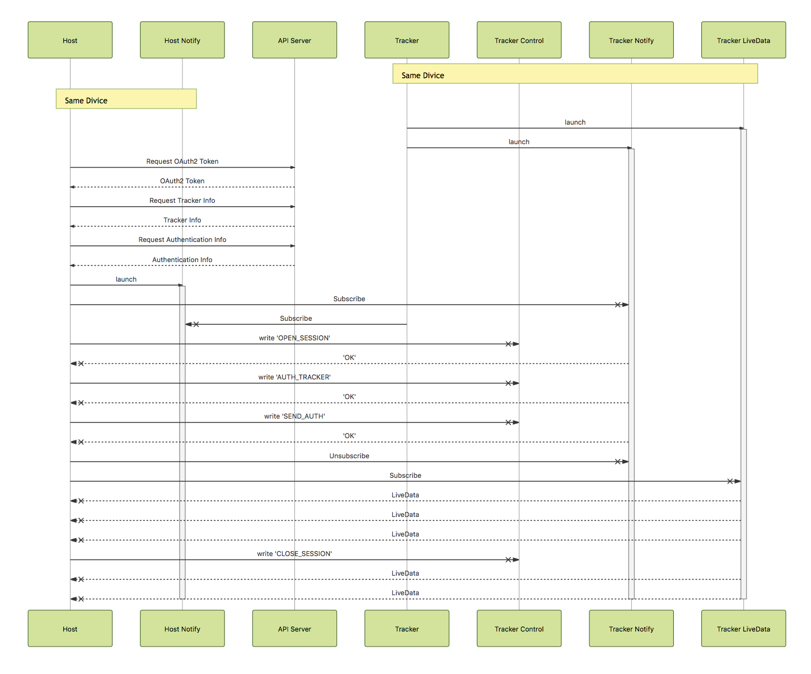

# node-fitbit-livedata
This project aims to getting `livedata` from Fitbit tracker

## !!! CAUTION !!!
This is an **UNOFFICIAL** and **EXPERIMENTAL** module.

Using this module sometimes forcibly logs out from fitbit application on your mobile device.

## Requirement
- Host Machine
    - macOS
- Runtime
    - node.js
- Fitbit Account
- Fitbit Tracker(Device) registered in the above account
    - Charge HR

## Install
This moudle is not published on npm yet.
So you have to clone this project at first.

```
$ git clone https://github.com/horihiro/node-fitbit-livedata.git
$ cd node-fitbit-livedata
```

### Install as library

```
$ npm i .
```

### Install as CLI tool

```
$ npm i . -g
```

## Usage

### Usage as library

```javascript
import FitbitLiveData from 'fitbit-livedata';
const fitbit = new FitbitLiveData();

fitbit.on('discover', (tracker) => {
  tracker.on('disconnect', (data) => {
    console.log('tracker is disconnected.');

    // if you want to re-connect automatically.
    tracker.connect();    
  });

  tracker.on('connect', (data) => {
    console.log('tracker is connected.');
  });
  tracker.on('openSession', (data) => {
    console.log('start tracker session');
  });
  tracker.on('authenticate', (data) => {
    console.log('start tracker authention.');
  });
  tracker.on('sendAuth', (data) => {
    console.log('start tracker authention.');
  });
  tracker.on('authenticated', (data) => {
    debug('tracker')('authenticated');
  });
  tracker.on('data', (livedata) => {
    process.stdout.write(`${JSON.stringify(livedata)}\n`);
  });
  tracker.connect();
});
fitbit.on('error', (error) => {
  console.error(`${error}\n`);
  process.exit(1);
});

const accounts = [
  {
    username: fitbitUser1_Username,
    password: fitbitUser1_Password
  },
  {
    username: fitbitUser2_Username,
    password: fitbitUser2_Password
  },
//  :
];

accounts.reduce((prev, curr) => {
  return prev.then(() => {
    return new Promise((resolve) => {
      fitbit.addAccount(curr)
        .then((trackerInfos) => {
          // login succeeded
          console.log(`${trackersInfos}\n`);
          resolve();
        })
        .catch((err) => {
          // login failed
          console.error(`login failed\n`);
          console.error(`${err}\n`);
          resolve();
        });
    });
  });
}, Promise.resolve()).then(() => {
  fitbit.scanTrackers();
});
```

### Usage as CLI tool

```sh
$ fitbit-livedata -u <USERNAME> -p <PASSWORD>
{"device":{"name":"Charge HR","address":"XX:XX:XX:XX:XX:XX","serialNumber":"0123456789ab"},"livedata":{"time":"YYYY-MM-DDThh:mm:dd.sssZ","steps":5700,"distance":4024236,"calories":1220,"elevation":13,"veryActive":2,"heartRate":80}}
{"device":{"name":"Charge HR","address":"XX:XX:XX:XX:XX:XX","serialNumber":"0123456789ab"},"livedata":{"time":"YYYY-MM-DDThh:mm:dd.sssZ","steps":5700,"distance":4024236,"calories":1220,"elevation":13,"veryActive":2,"heartRate":82}}
 :
```

## Memo
### Sequence Diagram between host, tracker and fitbit.com


[Japanese memo on Qiita](https://qiita.com/horihiro/items/03c4bef3e71539eddaad)
